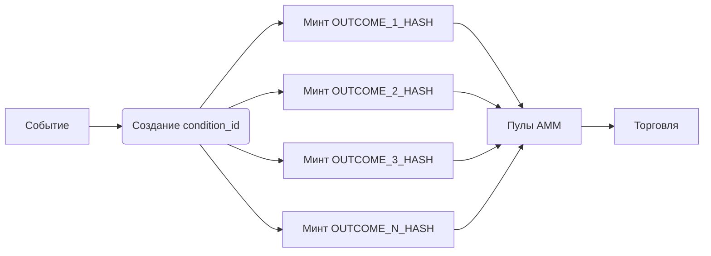
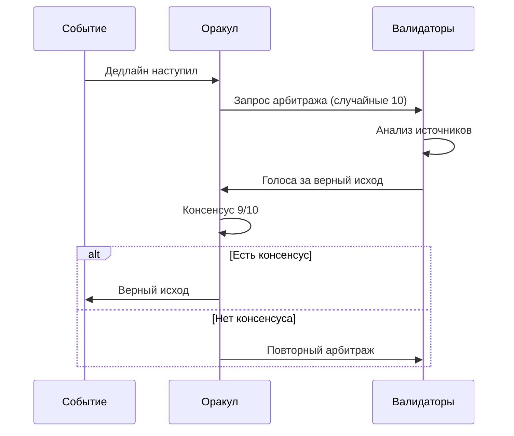
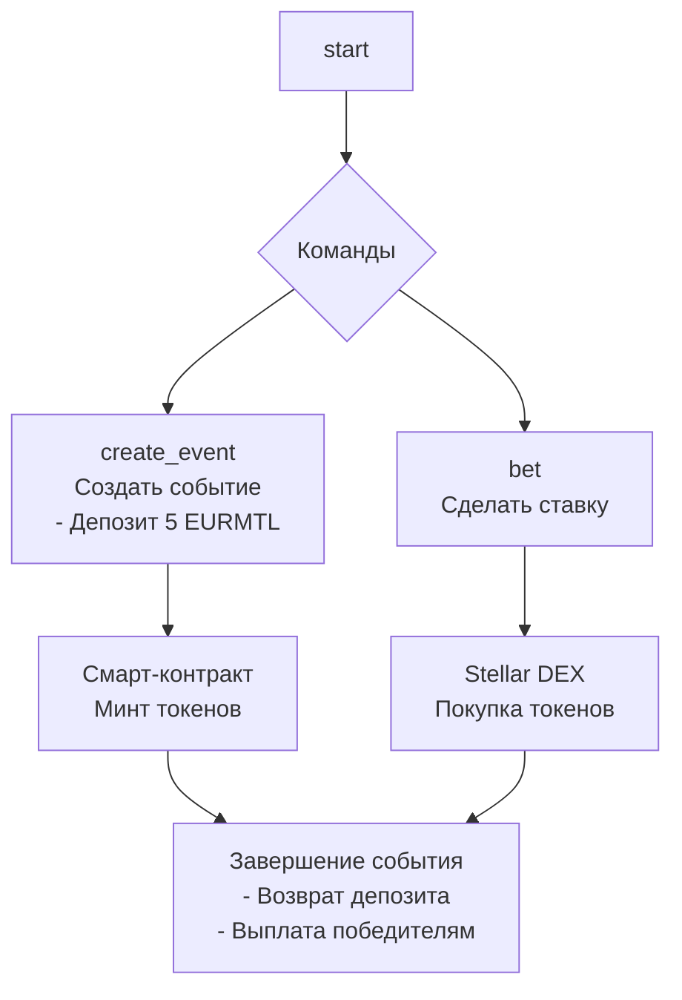
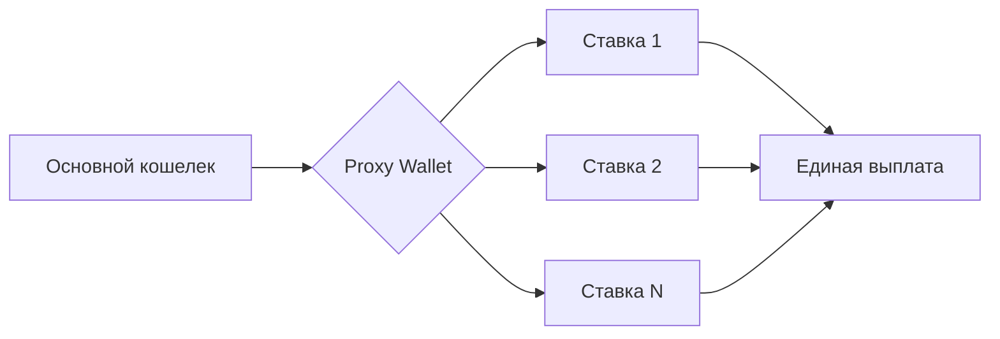

# Концепт биржи предсказаний в МТЛ-токеномике

*Авторы:*
- *Evgeny Turov (telegram: @ProtonEvgeny)*
- *Daniel (telegram: @Walk_m_a_n)*
- *Sonya (telegram: @eshkerequeen)*

## Введение

Мы представляем автономную платформу для ставок на события, построенную на трех столпах:
1. **Собственный Conditional Token Framework** для блокчейна Stellar (аналог Gnosis Conditional Token Framewrok), где каждый исход токенизируется как Stellar Asset.
2. **Децентрализованный оракул с механикой, основанной на теории игр**, где валидаторы получают доход за честность, а абсентеизм и мошенничество становится экономически невыгодным.
3. **Интеграция с МТЛ-токеномикой:**
	- EURMTL как базовый актив
	- Стекинг МТЛ-актива для участия в валидации итогов событий

**Для пользователей:** быстрый, удобный и безопасный способ делать ставки на мировые и локальные события

**Для инвесторов:** доход от комиссий, а также привлечение внешних средств в экономику Монтелиберо

### Что дальше?
В следующих разделах мы детализируем:
* Архитектуру CTF для Stellar
* Механизм верификации итогов событий
* Экономическую модель, где выигрывают все участники
* MVP и полную версию продукта

## Conditional Token Framework

За основу стоит взять существующий [Gnosis Conditional Framework](https://github.com/gnosis/conditional-tokens-contracts/tree/master) для блокчейна Ethereum, но перенести его логику на Soroban для блокчейна Stellar.
- Каждый исход события — это отдельный ассет вида `OUTCOME_N_<hash_condition>`.
- Балансы хранятся в аккаунтах пользователей через трастлайны к MTL.
- Пользователь покупает/продает токен через AMM-пулы.
- Диапазон цены токена от 0.0 до 1.0.
- Цена динамически рассчитывается через CPMM или LMSR.
- После верификации исхода события от оракула, токены неверных исходов сжигаются, а токен верного исхода принудительно продается за 1.0 и победителям возвращается базовый актив.

## Оракул для верификации исхода события

Общий процесс верификации исхода события с помощью оракула:

Ключевые особенности оракула:
- **Депозит за участие** - 500 EURMTL
- **Награда за верную верификацию** - 0,3% от пула события
- **Штраф за абсентеизм** - 10% от депозита
- **Штраф за неверную верификацию** - 50% от депозита
- **Случайный выбор валидаторов**
- **Публичный реестр решений с обязательной привязкой к источникам**

### Почему это работает?
Есть выраженный стимул предоставлять только достоверный результат. Под каждое событие выбираются случайные участники, чтобы снизить вероятность сговора, а также они должны прийти к консенсусу. Мошенник моментально понесет большие убытки, как финансовые, так и репутационные. Такая схема успешно работает на рынке, например [оракул UMA на блокчейне Ethereum](https://uma.xyz/).

**Дополнительное стимулирование:** при депозите >= 5000 EURMTL валидатор получает +5% к вознаграждению.

## MVP: Бот Telegram

Преимущества:
- Легче разработка, отсутствие сложной логики
- Быстрый запуск, легче завлечь аудиторию

Недостатки:
- Проблемы с масштабируемостью при большом потоке пользователей
- Ограниченный UI

Прототип:

На этапе MVP можно упростить создание и верификацию событий, если подтягивать данные из Polymarket, но тогда происходит урезание функционала и теряется истинный дух децентрализации.

**Стек:**
- Бот - Python/Golang
- Смарт-контракты - Soroban (Rust)
- Фронтенд - Inline-кнопки

**Сроки и ресурсы для реализации MVP:**
- Разработка смарт-контрактов (Conditional Token Framework):
  - 3 месяца
  - 12 000 EURMTL
  - 3 разработчика Rust/Soroban
- Бот Telegram:
  - 1,5 месяца
  - 3 000 EURMTL
  - 2 разработчика Python/Golang

**Итого:** около 3-4 месяцев разработки, 15 000 EURMTL

## MLP: Полноценная биржа предсказаний

Преимущества:
- Полная работа на блокчейне Stellar
- Независимая система создания событий пользователями
- Независимый оракул
- Отдельная веб-платформа с продуманным UI
- Самоокупаемая экосистема

Ограничения:
- Больший срок разработки
- Время на полноценный аудит безопасности

На полноценной платформе, пользователи сами смогут создавать события. Для защиты от спама, за создание события стоит взымать определнный депозит, который возвращается создателю после завершения.

Также, одной из ключевых возможностей будет реализация полноценного ордербука и лимитных ордеров ([аналог на Polymarket](https://docs.polymarket.com/developers/CLOB/introduction)). Это позволит пользователям эффективно участвовать в экосистеме и помогает агрегировать ликвидность.

Для лучшего пользовательского опыта, стоит рассмотреть внедрение Proxy Wallets (аналогично на Polymarket):

Также, для стимулирования лучшей ликвидности, стоит продумать специальную программу для стимулирования, [аналогичную Polymarket](https://docs.polymarket.com/polymarket-learn/trading/liquidity-rewards).

**Стек:**
- Смарт-контракты - Soroban (Rust)
- Фронтенд - React/Angular/Vue.js
- Вспомогательные компоненты - Python

**Сроки и ресурсы для реализации MLP:**
- Разработка системы оракула:
  - 4 месяца
  - 15 000 EURMTL
  - 3 разработчика
- Веб-платформа
  - 3 месяца
  - 20 000 EURMTL
  - 4 разработчика + 2 дизайнера

**Итого:** около 7 месяцев разработки, 35 000 EURMTL
